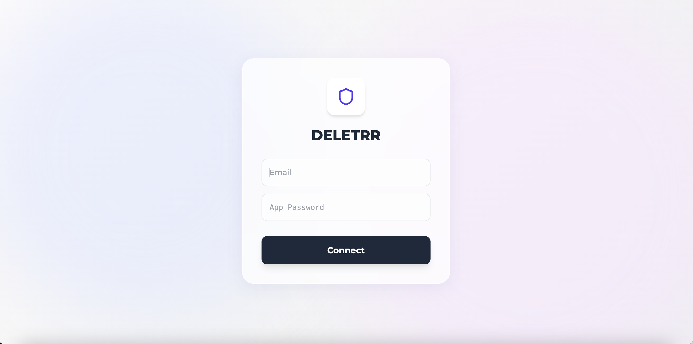
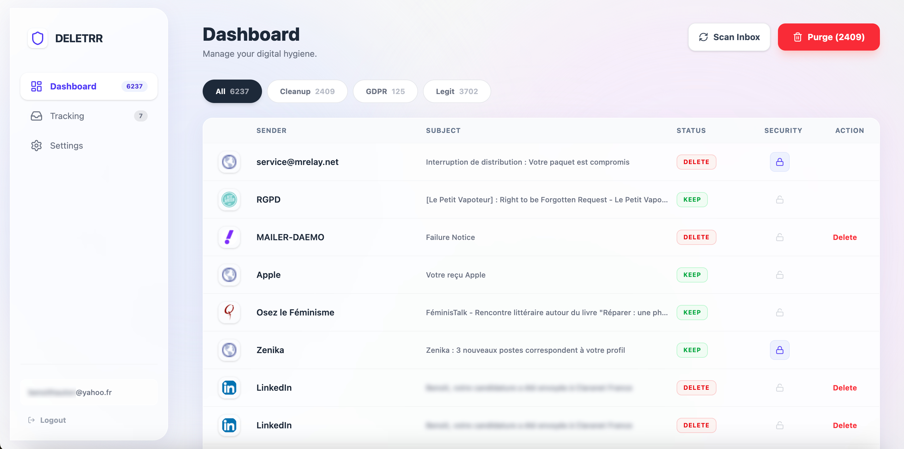
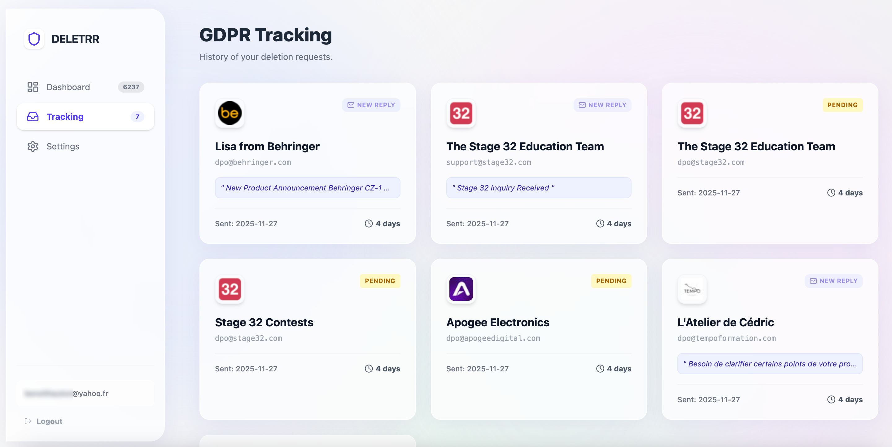
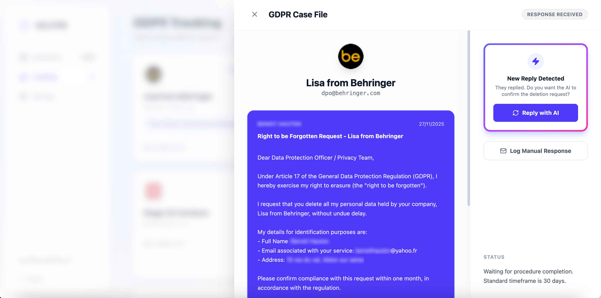
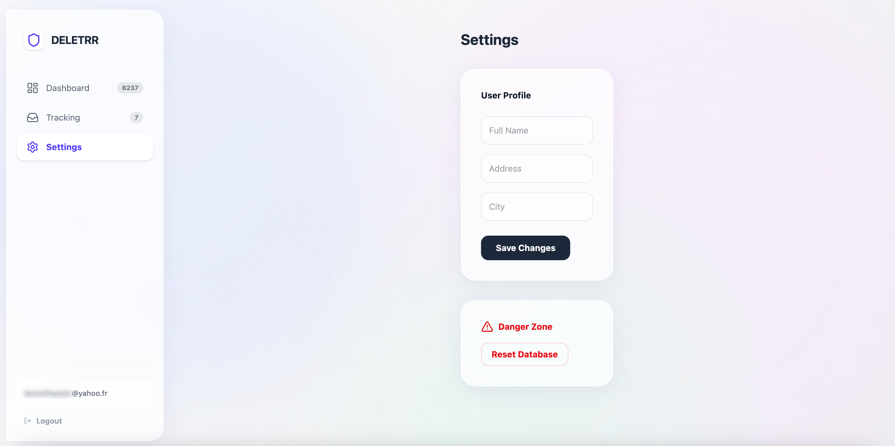

<p align="center">
  
</p>

# DELETRR

## Why I Built This

Every company gets hacked eventually. LinkedIn, Adobe, Dropbox, Yahoo... the list goes on. Every account you've ever created is a potential data breach waiting to happen. My goal was simple: clean up years of inbox mess and make sure companies no longer hold my personal data so when they inevitably get breached, I'm not part of the leak.

This tool automates what would take weeks to do manually: scan thousands of emails, delete the junk, and send GDPR "Right to be Forgotten" requests to every company that still has my data.

## How It Works

### 1. Scan and Clean

The app connects to your inbox via IMAP and analyzes each email with a local AI (Ollama). The AI classifies emails into three categories:

- **DELETE**: Notifications, auto-replies, security alerts, job alerts, social network spam. Stuff you don't need. One click and it's gone.
- **RGPD_UNSUB**: Marketing emails, newsletters, promotional content from identifiable companies (Netflix, Amazon, etc.). These are candidates for GDPR deletion requests.
- **KEEP**: Personal emails, invoices, bills, travel tickets, bank/government communications. The AI knows not to touch these.

### 2. Send GDPR Requests

For every company flagged as RGPD_UNSUB, the app:

1. Searches the web for the company's DPO (Data Protection Officer) or privacy contact email
2. Uses AI to extract the right email from search results (looks for privacy@, dpo@, dataprotection@)
3. Generates a formal "Right to be Forgotten" request citing GDPR Article 17
4. Sends it automatically from your email account

### 3. Handle Responses Automatically

Companies love to make GDPR requests painful. They ask for ID verification, confirmation emails, or just try to stall. The app:

1. Scans your inbox for replies from companies you've contacted
2. Uses AI to filter out noise (newsletters, promos) from actual responses
3. Summarizes each response so you don't have to read corporate jargon
4. Proposes automated follow-up responses when they ask for confirmation

The goal is to make exercising your privacy rights as frictionless as possible.

## Screenshots

### Login
Connect with your email and app password (not your real password).



### Dashboard
Scan your inbox and see all emails classified by the AI. Filter by category, delete junk in one click, or start a GDPR request.



### GDPR Tracking
Track all your deletion requests. See which companies replied and which are still pending.



### Case Details
View the full conversation with a company. When they reply, the AI summarizes it and proposes a response.



### Settings
Configure your identity for GDPR requests (name, address) and reset the database if needed.



## Tech Stack

**Backend**
- Flask (Python)
- SQLite with Flask-SQLAlchemy
- IMAP/SMTP for email operations
- Ollama (llama3:8b) for local AI inference

**Frontend**
- React 18
- Tailwind CSS
- Lucide React icons
- Vite

## Architecture Choices

### Local AI with Ollama
I chose Ollama over cloud APIs (OpenAI, Claude) for privacy reasons. Since the app handles sensitive email data, keeping AI inference local ensures no data leaves the user's machine. The trade-off is requiring users to run Ollama locally.

### IMAP over Gmail API
Using raw IMAP instead of Gmail's API makes the app provider-agnostic. Same codebase works for Gmail, Outlook, Yahoo without managing multiple OAuth flows. Users generate app-specific passwords instead.

### SQLite
Simple, file-based, no server needed. Fits the local-first philosophy of the project.

### Flask Sessions
Stateful sessions store user credentials server-side. Not scalable for production but simple for a personal tool.

## Installation

### Prerequisites
- Python 3.10+
- Node.js 18+
- Ollama with llama3:8b model

### Backend Setup

```bash
cd backend
pip install -r requirements.txt
python app.py
```

### Frontend Setup

```bash
cd frontend
npm install
npm run dev
```

### Ollama Setup

```bash
ollama pull llama3:8b
ollama serve
```

## Configuration

### Email App Passwords

**Gmail**: Create an app password at https://myaccount.google.com/apppasswords (requires 2FA enabled)

**Outlook**: Create an app password in Microsoft account security settings

**Yahoo**: Create an app password at https://login.yahoo.com/account/security

## Usage

1. Start Ollama, backend, and frontend
2. Login with your email and app password
3. Click "Scan" to analyze your inbox
4. Review detected emails by category
5. Click "Manage" on GDPR items to send deletion requests
6. Track responses in the Tracking tab

## Project Structure

```
├── app.py              # Flask backend (API routes, IMAP logic, AI calls)
├── requirements.txt    # Python dependencies
├── src/
│   ├── App.jsx         # Main React component
│   ├── App.css         # Component styles
│   ├── index.css       # Global styles (Tailwind)
│   ├── Loader.css      # Loading toast styles
│   └── main.jsx        # React entry point
└── public/
```

## API Endpoints

| Method | Endpoint | Description |
|--------|----------|-------------|
| POST | /api/login | Authenticate with email/app password |
| POST | /api/scan | Scan inbox for emails |
| GET | /api/emails | Get scanned emails |
| POST | /api/delete | Delete email from inbox |
| POST | /api/rgpd/send | Send GDPR deletion request |
| GET | /api/rgpd/cases | Get all GDPR cases |
| POST | /api/rgpd/scan-replies | Scan for company responses |
| POST | /api/whitelist | Add sender to whitelist |

## Security Notes

- App passwords are stored in SQLite (not hashed). This is a local tool, not meant for multi-user deployment.
- Set `SECRET_KEY` environment variable in production
- CORS is configured for localhost only

## License

MIT
